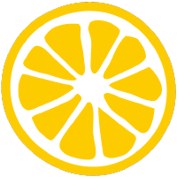

# Автоматизация тестирования для OTUS

Репозиторий содержит автоматизированные тесты, написаны в рамках курса ["Java QA Engineer. Professional"](https://otus.ru/lessons/java-qa-pro/).

## Ветвление в репозитории

- `main`: основная ветка. Содержит UI-тесты, разработанные с применением двухуровневого подхода к дизайну тестов и с
  использованием паттернов проектирования.
- `homework_2`: ветка, содержит UI-тесты, написанные с использованием **BDD** подхода через **Cucumber**.
- `homework_3`: ветка, содержит API-тесты, написанные с использованием **Citrus Framework**.

## Технологии и иструменты

Автотесты написаны на языке `Java` с использованием `JUnit 5`, `Selenium WebDriver`, `Cucumber`, `Citrus Framework`. Сборщик
проекта - `Maven`.
<p align="center">
    <a href="https://www.java.com/">
      
    </a>
    <a href="https://www.jetbrains.com/">
      
    </a>
    <a href="https://maven.apache.org/">
      
    </a>
    <a href="https://junit.org/junit5/">
      
    </a>
    <a href="https://github.com/">
      
    </a>
    <a href="https://www.selenium.dev">
      
    </a>
    <a href="https://www.google.com/intl/en/chrome/">
      
    </a>
    <a href="https://www.mozilla.org/en-US/firefox/new/">
      
    </a>
    <a href="https://cucumber.io/">
      
    </a>
    <a href="https://citrusframework.org/">
      
    </a>
    <a href="">
      
    </a>
</p>

## Команда для запуска автотестов из терминала
Для запуска всех тестов необходимо выполнить команду в терминале:  
`mvn clean test`

Чтобы запустить UI-тесты, реализованные по методологии **BDD (Cucumber)**, необходимо переключиться на ветку `homework_2`
командой:
```bash
git checkout homework_2
```
и выполнить команду запуска тестов.

Для запуска всех тестов в **выбранном браузере**:
#### Chrome
`mvn clean test -Dbrowser=chrome`

#### Firefox
`mvn clean test -Dbrowser=firefox`

Чтобы запустить API-тесты, реализованные с помощью  **CitrusFramework**, необходимо переключиться на ветку `homework_3`
командой:
```bash
git checkout homework_3
```
и выполнить команду запуска тестов


